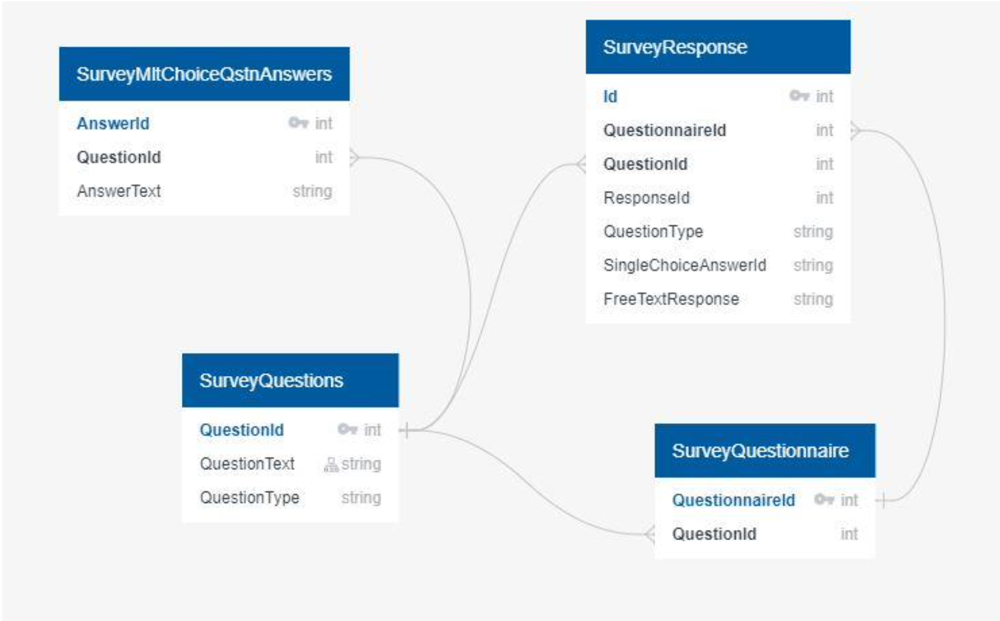

```{r setup}
library(RMySQL)
library(tidyverse)
library(reactable)
```

## Introduction

The data source we will be using is a [2020 survey from Kaggle](https://www.kaggle.com/c/kaggle-survey-2020) which surveyed Data Scientist. The questions in the survey asked about which languages, tools, and skills that Data Scientist use daily. The data is a csv file with 355 columns and 20,000 rows and will need to be cleaning up before it is uploaded into a normalized database. With the dataset we will looking at the answers and seeing what answers come up frequently as those are the skills and tools that are the valuable skills that data scientists have.

In the survey 39 questions were asked. Many of the survey questions are relevant to answering, "What is the most valued data science skills." The survey also included sub questions which was labeled using the question number and a letter. The data set also includes branching questions where if a question if a specific question is answered then an alternative question is asked. The dataset is a very long and sparse data set which will require a lot of cleaning before any data analysis can be done.



In order to normalize the database, we created a relational database using tables with primary keys. This allows the database to be organized and joined in many ways. The database tables are split into questions, answers, and user responses and are all joined using index and primary keys. All the information is uploaded into Amazon Web Services allowing multiple people to be querying the dataset at the same time.

## Opening Connection to SQL Server

We will begin by opening a connection to the SQL instance that was created on AWS. For security puroposes the password can be stored in a file that will not be synced to github, or the user will be prompted to enter it if using RStudio.

```{r establish-sql-connection}
pwfile <- "db_pw.txt"
if ( file.exists(pwfile) )
{
  pass <- readLines(pwfile)
}else 
{
  pass <- rstudioapi::askForPassword( prompt = "Please enter DB password:" ) 
}

conn = dbConnect(MySQL(), user='admin', pass= pass , dbname='project3db', 
                 host='project3.c4h7w2meulft.us-east-1.rds.amazonaws.com', port=3306)

dbListTables(conn = conn)
```

## Import Raw Data from Github

The raw data is availble from Kaggle. However, for easier access we have uploaded it to a [github repository](https://raw.githubusercontent.com/xvicxpx/CUNY-SPS-Data-607-Project-3/main/kaggle-survey-2020/kaggle_survey_2020_responses.cs) to be used for this project.

```{r import-raw-data, message=FALSE}
rawDataGitHub <- read_csv('https://raw.githubusercontent.com/xvicxpx/CUNY-SPS-Data-607-Project-3/main/kaggle-survey-2020/kaggle_survey_2020_responses.csv')
```

Please find the head of the raw data.

```{r raw-data-preview}
reactable(head(rawDataGitHub,20))
```

## Tidying Data

## Insert into SQL
